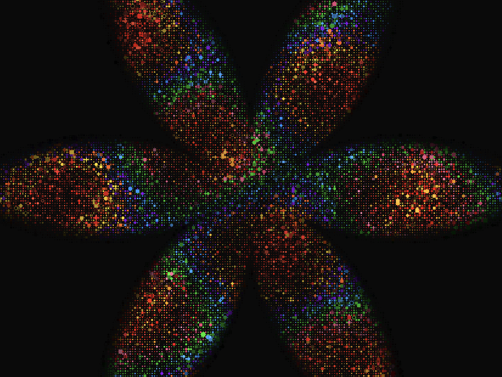

<p align="center">
  
</p>

# MALAI

Interactive generative art on the GPU. Animated grid of geometric shapes rendered via Three.js instanced mesh and custom GLSL shaders.

## Features

- **Grid masks** — rectangle, latin cross, star
- **Media masks** — image, video, or webcam
- **Mouse interaction** — cells react to cursor proximity
- **Infinite scroll** — seamless diagonal drift
- **Real-time GUI** — tweak everything on the fly

## Requirements

- Node.js 18+
- Browser with WebGL support

## Quick Start

```bash
npm install
npm run dev
```

## Tech

[Three.js](https://threejs.org/) · [lil-gui](https://lil-gui.georgealways.com/) · [Vite](https://vite.dev/)
